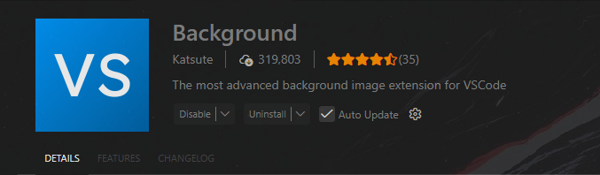
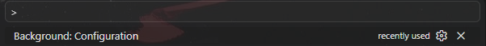
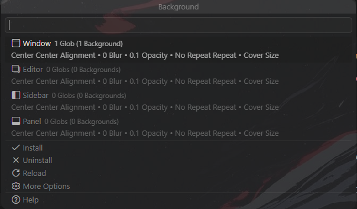
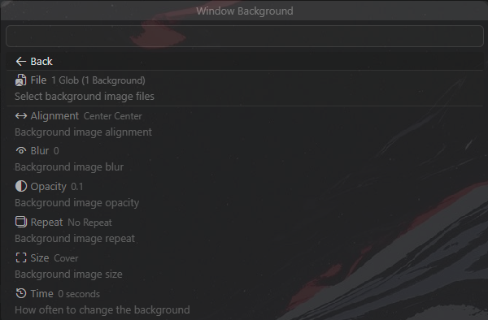
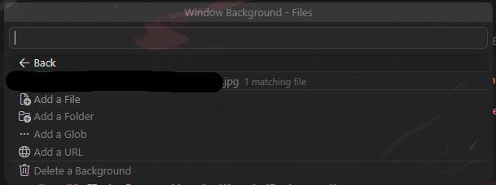
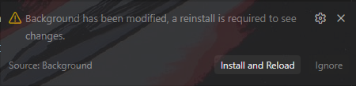
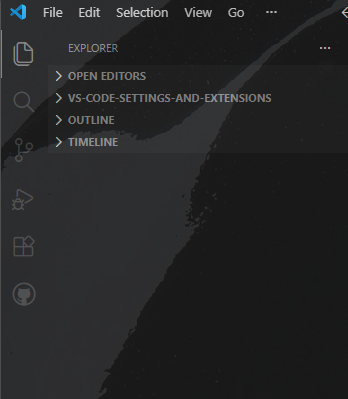
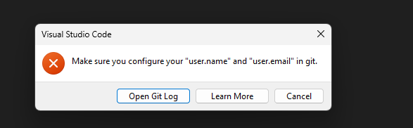
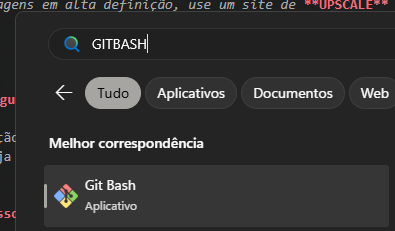
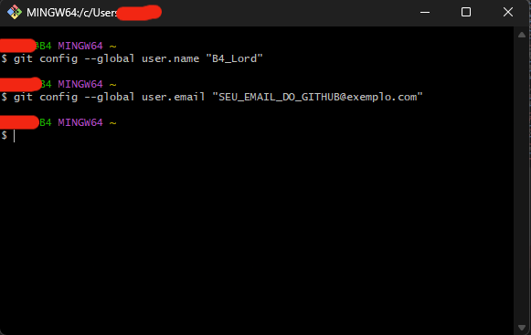

<h1 align="center">💻 Minhas Configurações do VS Code + Extensões</h1>

## Este guia explica como configurar o visual do meu VS Code e a integração com o Git/GitHub conforme as capturas de tela.

---

## 🎨 1. Personalização Visual (Background)

Para deixar o editor com imagens de fundo personalizadas, utilizo a extensão **Background**.

### Passo a Passo:
1. Instale a extensão **Background** (criada por Katsute) na Marketplace do VS Code.

   

2. Pressione `CTRL + SHIFT + P`, digite **"Background: Configuration"** e selecione a opção que aparecer.

   

3. No menu de configuração, navegue até a aba **Window** e selecione-a .

   

4. Vá na seção **File**.

   

5. Depois clique em **Add a File ou em Add a URL** e adicione o caminho do arquivo da imagem no seu PC ou uma URL...

    

6. No canto Direito Inferior vai aparecer um botão ***(Install and Reload)*** para reniciar e aplicar o Wallpaper.

    


*Dica: Para imagens em alta definição, use um site de **UPSCALE** antes de colocar a imagem no VS Code.*

---

## 🛠️ 2. Configurando o Git e Terminal (Git Bash)

Esta configuração permite realizar **commits** diretamente pelo VS Code, garantindo que seu repositório seja atualizado em tempo real no GitHub sem a necessidade de comandos externos complexos.

### Passo a Passo para Instalação e Inicialização:

### Instalação e Inicialização:
1. Baixe o Git para Windows em: [git-scm.com/download/win](https://git-scm.com/download/win).

   

2. No VS Code, abra a aba de **Source Control** (ícone de ramificação na lateral) e clique em **Initialize Repository**.

   

### Configuração de Identidade (Resolvendo Erros):

ERRO:




Se ao tentar dar um **Commit** aparecer um erro pedindo `user.name` e `user.email`, abra o seu terminal (Git Bash) e digite os seguintes comandos (um por vez mudando os dados para os da sua conta do Github):



```bash
git config --global user.name "SEU_NOME_AQUI"
git config --global user.email "SEU_EMAIL_DO_GITHUB@exemplo.com"
```



*Após rodar os comandos (uma linha por vez, dando Enter), feche o Visual Studio Code e abra-o novamente. Tente fazer o commit mais uma vez.*

---

## 🚀 3. Conectando com o GitHub e Publicando

Com a identidade configurada, você já pode enviar seu repositório para a nuvem.

1. Na aba de Source Control, clique em **Publish Branch**.
   > ![COLOQUE_A_IMAGEM_PUBLISH_BRANCH_AQUI]

2. O VS Code vai pedir permissão para acessar o GitHub com a mensagem *"The extension 'GitHub' wants to sign in using GitHub"*. Clique em **Allow**.
   > ![COLOQUE_A_IMAGEM_ALLOW_GITHUB_AQUI]

3. Na barra superior que aparecer, escolha se o repositório será **Público** ou **Privado**.
   > ![COLOQUE_A_IMAGEM_PUBLIC_PRIVATE_AQUI]

4. Uma aba será aberta no navegador pedindo para autorizar. Clique em **Sign in with your browser** e faça o login.
   > ![COLOQUE_A_IMAGEM_SIGN_IN_BROWSER_AQUI]

5. Vá no site do GitHub, acesse seu perfil e verifique se o repositório foi criado certinho.
   > ![COLOQUE_A_IMAGEM_REPOSITORIO_CRIADO_AQUI]

### ⚠️ Verificação de Perfil (Caso dê erro)
Vá no ícone de Conta/Perfil no canto inferior esquerdo do VS Code e confira se a sua conta do GitHub aparece logada.
> ![COLOQUE_A_IMAGEM_PERFIL_LOGADO_AQUI]

Se não estiver e estiver dando erro, vá na aba de extensões, pesquise e instale separadamente a extensão **GitHub Pull Requests and Issues**.
> ![COLOQUE_A_IMAGEM_EXTENSAO_GITHUB_PULL_REQUESTS_AQUI]

---

## 🧪 4. Teste de Funcionamento (Como dar Commit)

Para testar se tudo está funcionando e entender como o VS Code mostra as edições:

1. Escreva qualquer coisa no seu código. O VS Code vai identificar (ficando vermelho se for um erro de sintaxe) e o arquivo ficará com um **"M"** (Modified) na aba de controle de versão.
2. Se você clicar nesse arquivo com o "M", o VS Code vai abrir uma tela dividida mostrando o **Antes e o Depois**. Ele salva as duas versões: a anterior (caso queira reverter) e a nova que vai virar a principal.
   > ![COLOQUE_A_IMAGEM_ERRO_E_COMPARACAO_AQUI]

3. Para salvar (dar commit), clique em **Commit** e confirme em **Yes** se aparecer algum aviso.
4. Vai abrir uma aba chamada `COMMIT_EDITMSG`. Escreva a mensagem do seu commit na **primeira linha** (linha 1, que está vazia).
   > ![COLOQUE_A_IMAGEM_COMMIT_EDITMSG_AQUI]

5. Para o commit ir de fato, basta fechar essa aba no "X" ou clicar na caixa/botão de confirmação no canto da tela.
   > ![COLOQUE_A_IMAGEM_CONFIRMACAO_COMMIT_AQUI]

   ---

## 🔄 6. Sincronizando Alterações (Push)

Depois de realizar o commit localmente, você precisa enviar essas mudanças para o servidor do GitHub para que outras pessoas (ou você em outro PC) possam ver.

1. No canto inferior esquerdo ou na aba de Source Control, clique no ícone de setas circulares ou no botão **Sync Changes**.
   > ![COLOQUE_A_IMAGEM_BOTAO_SYNC_CHANGES_AQUI]

2. Se aparecer um aviso sobre o "Push" e "Pull", clique em **OK**. Isso fará com que o VS Code envie suas fotos/códigos novos e baixe qualquer coisa que tenha mudado no site.
   > ![COLOQUE_A_IMAGEM_AVISO_PUSH_PULL_AQUI]

---

## ⚠️ 7. Dicas Importantes e Erros Comuns

### Arquivos em Vermelho vs. Verde
* **Verde (U - Untracked):** Arquivos novos que o Git ainda não conhece.
* **Amarelo/Laranja (M - Modified):** Arquivos que já existiam, mas foram alterados.
* **Vermelho:** Indica erro de sintaxe no código (não no Git), o que ajuda a debugar antes de salvar.
   > ![COLOQUE_A_IMAGEM_DIFERENCA_CORES_ARQUIVOS_AQUI]

### Revertendo Mudanças
Se você fez uma alteração e se arrependeu antes de dar o commit:
1. Clique com o botão direito no arquivo dentro da aba Source Control.
2. Selecione **Discard Changes**. O arquivo voltará a ser exatamente como era antes.
   > ![COLOQUE_A_IMAGEM_DISCARD_CHANGES_AQUI]

---

## 🎨 8. Resultado Final do Ambiente

Após seguir todos os passos, seu VS Code deve estar com o fundo personalizado e totalmente integrado ao seu perfil do GitHub, facilitando o estudo e a organização dos seus projetos.

> ![COLOQUE_A_IMAGEM_DO_SEU_VSCODE_PRONTO_AQUI]

---
**Feito com ❤️ por [SEU NOME]**