<h1 align="center">💻 Minhas Configurações do VS Code + Extensões</h1>

## Este guia explica como configurar o visual do meu VS Code e a integração com o Git/GitHub conforme as capturas de tela.

---

# ⚙️ 1. Configurações Básicas do VS Code

Antes de qualquer coisa, deixo meu VS Code mais confortável e produtivo com essas configurações essenciais. Todas elas são feitas no **User Settings** (configurações do usuário).

### Como abrir as configurações
1. Pressione `Ctrl + Shift + P`
2. Digite `>open` e escolha **Preferences: Open User Settings** (ou simplesmente `Ctrl + ,`).

   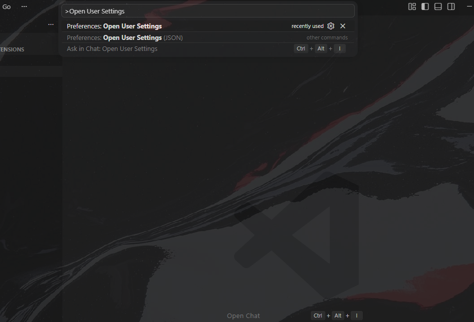

### Font Size (tamanho da fonte)
- Vá em **Text Editor > Font > Font Size**
- Recomendo que coloque **14 ou 16** 

### Word Wrap (quebra automática de linha)
- Vá em **Editor: Word Wrap**
- Coloque **on** (ligado)

Imagem para referência:

   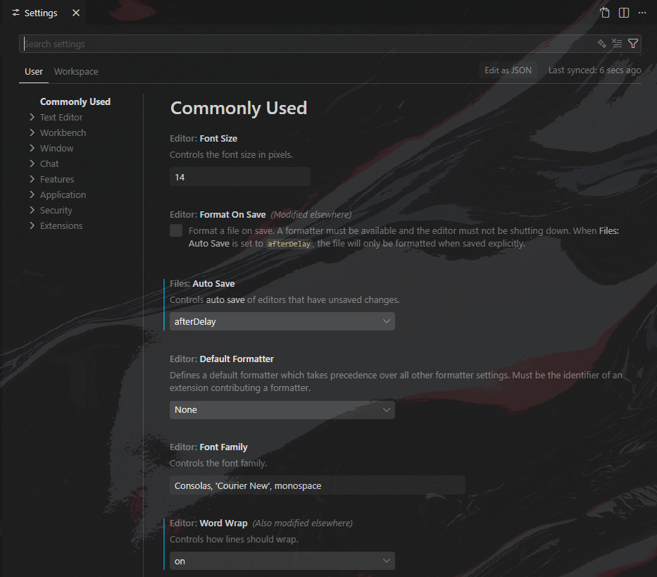

### Auto Save (salvar automático)
- Pesquise por em **Files: Auto Save**
- Escolha **afterDelay** (salva automaticamente depois de segundos da alteração)

   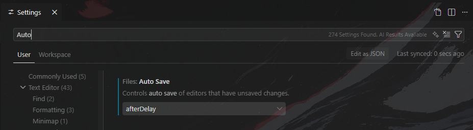

---

# 🎨 2. Extensões de Visual e Utilidade

Aqui estão as extensões que deixam o VS Code **bonito** e **prático**.

### Pesquise por Min Theme em extensões.

   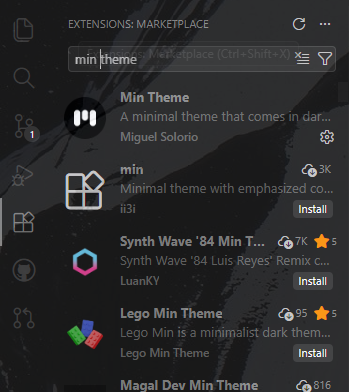

- Clique em instalar e depois no botão **Set Color Theme**.

   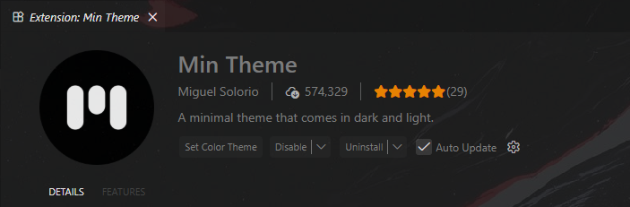

- Escolha o tema da sua preferência.

   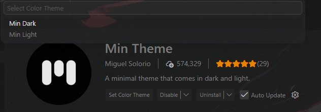

### Pesquise por Symbols em extensões.
- Clique em instalar e depois no botão **Set File Icon Theme** (ou “Set Icon Theme”).

   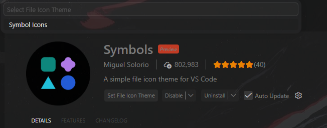

### Live Server (Obrigatória para Front-End!)

- Descrição: Cria um servidor local com **live reload** (atualiza automaticamente a página quando você salva).

- Clique em instalar

   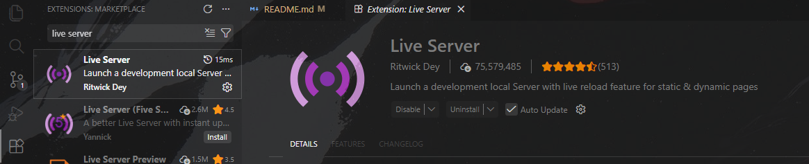

- Para usar, clique no botão **Go Live** que aparece na barra inferior direita.

   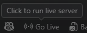

**Resultado:** Você vê as mudanças em tempo real no navegador sem precisar ficar atualizando manualmente. Essencial para front-end!

---

# 🎨 3. Personalização Visual (Background)

Para deixar o editor com imagens de fundo personalizadas, utilizo a extensão **Background**.

### Passo a Passo:
- Instale a extensão **Background** (criada por Katsute) na Marketplace do VS Code.

   

- Pressione `CTRL + SHIFT + P`, digite **"Background: Configuration"** e selecione a opção que aparecer.

   

- No menu de configuração, navegue até a aba **Window** e selecione-a .

   

- Vá na seção **File**.

   

- Depois clique em **Add a File ou em Add a URL** e adicione o caminho do arquivo da imagem no seu PC ou uma URL...

    

- No canto Direito Inferior vai aparecer um botão ***(Install and Reload)*** para reniciar e aplicar o Wallpaper.

    


*Dica: Para imagens em alta definição, use um site de **UPSCALE** antes de colocar a imagem no VS Code.*

---

# 🛠️ 4. Configurando o Git e Terminal (Git Bash)

Esta configuração permite realizar **commits** diretamente pelo VS Code, garantindo que seu repositório seja atualizado em tempo real no GitHub sem a necessidade de comandos externos complexos.

OBS: FAÇA LOGIN NO GITHUB PARA EVITAR ERROS, BASTA IR NO CANTO INFERIOR ESQUERDO - - - PARA CONFIRMAR QUE FEZ O LOGIN, VEJA SE APARECE SEU NOME + (GITHUB). 

   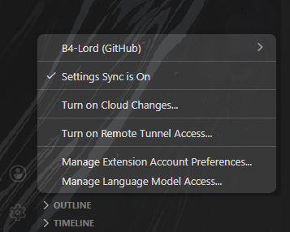

### Passo a Passo para Instalação e Inicialização:

### Instalação e Inicialização:
- Baixe o Git para Windows em: [git-scm.com/download/win](https://git-scm.com/download/win).

   

- No VS Code, abra a aba de **Source Control** (ícone de ramificação na lateral) e clique em **Initialize Repository**.

   

### Configuração de Identidade (Resolvendo Erros):

    Erro:


Se ao tentar dar um **Commit** aparecer um erro pedindo `user.name` e `user.email`, abra o seu terminal (Git Bash) e digite os seguintes comandos (um por vez mudando os dados para os da sua conta do Github):


```bash
git config --global user.name "SEU_NOME_AQUI"
git config --global user.email "SEU_EMAIL_DO_GITHUB@exemplo.com"
```


*Após rodar os comandos (uma linha por vez, dando Enter), feche o Visual Studio Code e abra-o novamente. Tente fazer o commit mais uma vez.*

---

## 🚀 5. Conectando com o GitHub e Publicando

Com a identidade configurada e confirmada, você já pode enviar seu repositório para a nuvem.

- Na aba de Source Control, clique em **Publish Branch**.

   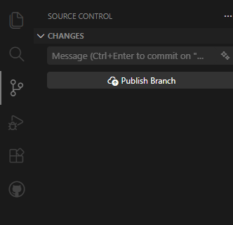

- O VS Code pode pedir permissão para acessar o GitHub com a mensagem *"The extension 'GitHub' wants to sign in using GitHub"*. Clique em **Allow**.

   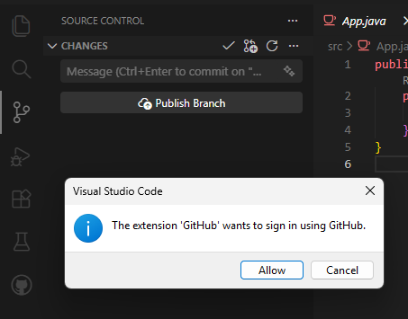

- Na barra superior que aparecer, escolha se o repositório será **Público** ou **Privado**.

   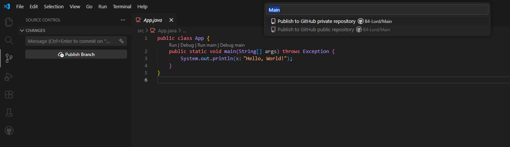

- Provavel que abra uma aba no navegador pedindo para autorizar. Clique em **Sign in with your browser** e faça o login.

   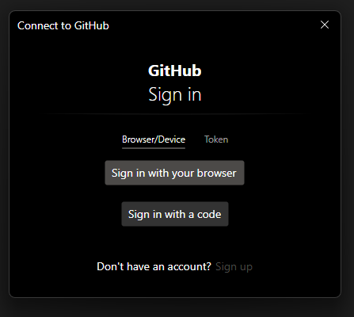

- Vá no site do GitHub, acesse seu perfil em seus repositórios e verifique se o repositório foi criado certinho.

   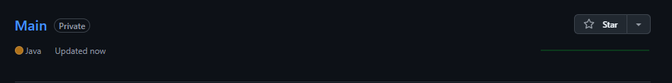

### ⚠️ Verificação de Perfil (Caso dê erro)

- Vá no ícone de Conta/Perfil no canto inferior esquerdo do VS Code e confira se a sua conta do GitHub aparece logada.

   

- Se não estiver e estiver dando erro, vá na aba de extensões, pesquise e instale separadamente a extensão **GitHub Pull Requests and Issues**.

   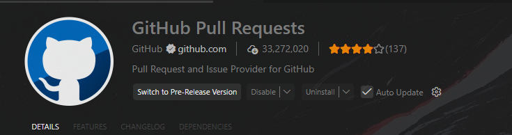


## 🔄 6. Commitando e Sincronizando Alterações (Push)

Este é o processo para salvar suas versões e enviar para o GitHub em tempo real.

### Passo 1: Fazer uma alteração

Para que o Git identifique uma mudança, você precisa alterar algo no código ou adicionar um novo arquivo à sua pasta de projeto. O VS Code mostrará um número na aba de **Source Control**.

   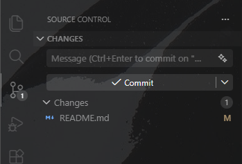

### Passo 2: O Processo de Commit

- Clique no ícone de **Source Control** na barra lateral.
- Clique no botão **Commit** (o botão azul/verde com o check).
- Automaticamente, o VS Code abrirá um arquivo de texto chamado `COMMIT_EDITMSG`.

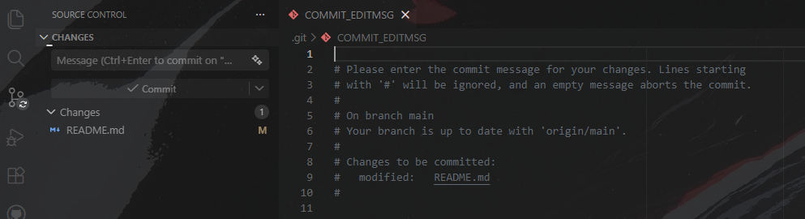

- **Escreva a palavra "commit"** (ou uma descrição da sua mudança) na primeira linha deste arquivo.

   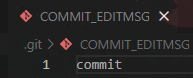

- **Feche o arquivo `COMMIT_EDITMSG`** clicando no "X" da aba. Isso confirma o commit no seu computador.

### Passo 3: Sincronizar (Push)

- Agora, clique no botão **Sync Changes** (ou no ícone de setas circulares no canto inferior).

   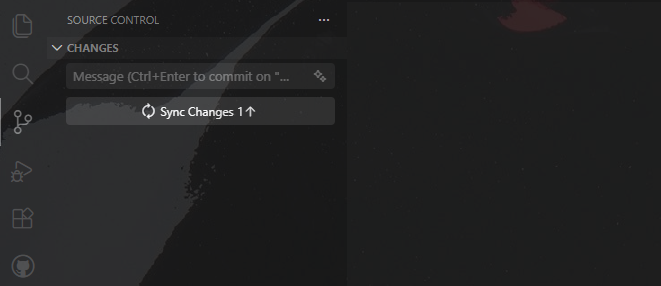

- Se tudo der certo, você vai conseguir vizualizar uma parte escrito **GRAPH** e uma mensagem escrito commit + "Seu User" e seu repositorio no Github web estará atualizado.

   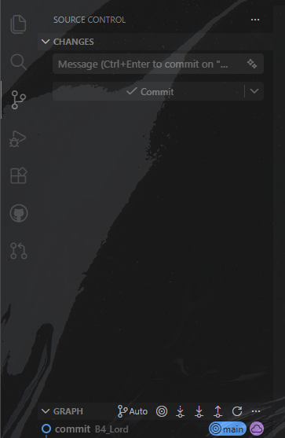

---

**Feito com ❤️ por B4_Lord**